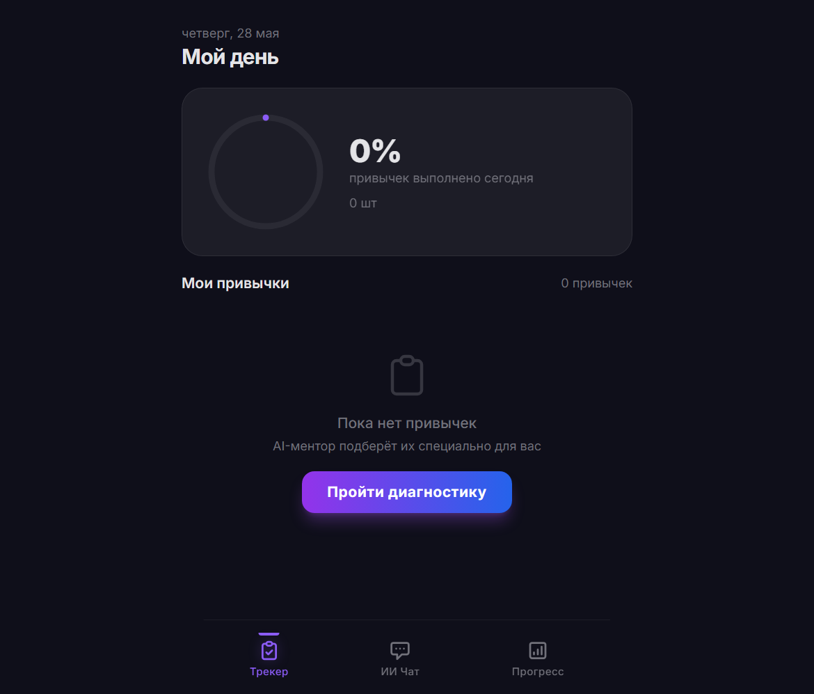
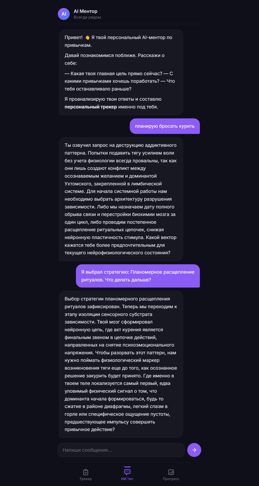
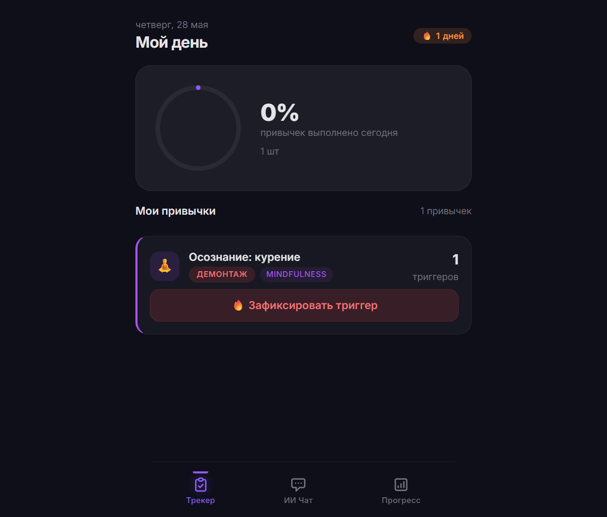
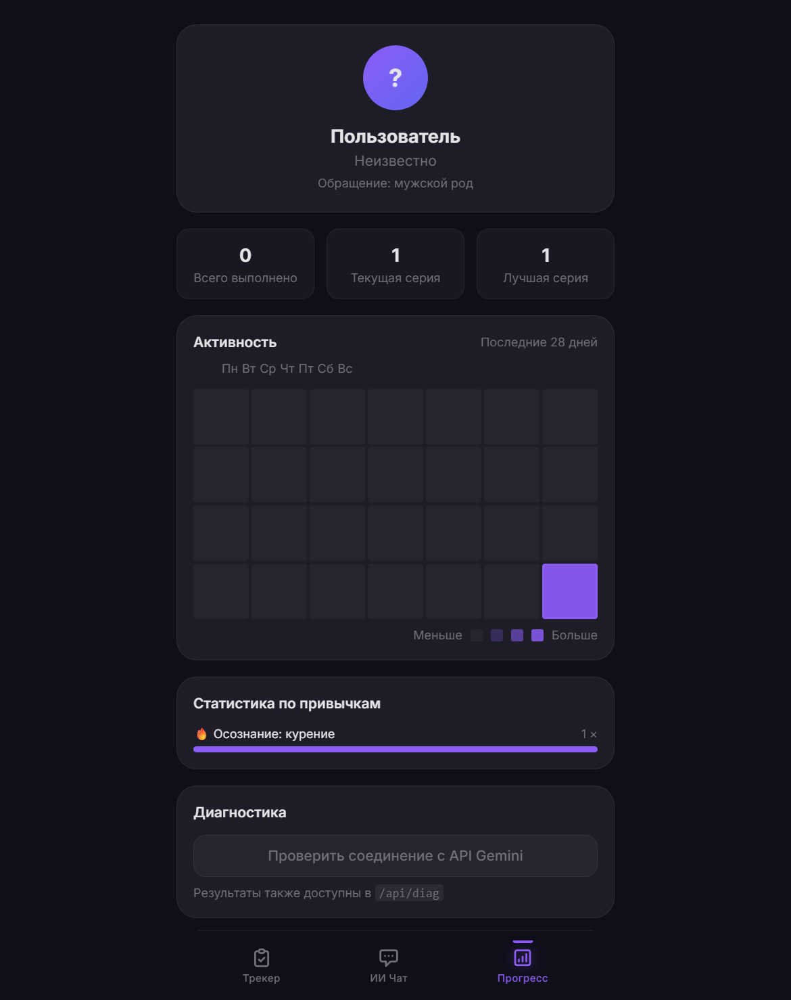

# Neuro-Adaptive AI Habit Mentor

**Премиальный AI-ментор привычек** — Telegram Mini App для деконструкции зависимостей (курение, сахар, соцсети) на основе когнитивного инжиниринга К-О-Д (Категория, Оператор, Детерминация).

Методология опирается на теорию функциональных систем П.К. Анохина и учение о доминанте А.А. Ухтомского. Никаких банальных советов — только научно обоснованная инженерия поведения.

---

## Скриншоты

| Экран трекера | AI-чат | Выбор стратегии | Прогресс |
|:---:|:---:|:---:|:---:|
|  |  |  |  |

*Добавьте файлы `110.png`–`113.png` в корень репозитория.*

---

## Как это работает

Пользователь общается с AI-ментором в чате. AI проводит его через **3 строгие фазы**:

| Фаза | Цель | Что происходит |
|------|------|----------------|
| **Фаза 1: Диагностика** | Выявить привычку + выбрать стратегию | AI предлагает: резкий отказ (с Днём Х) или плавное расщепление ритуалов |
| **Фаза 2: Изоляция триггеров** | Перевести в режим «Наблюдателя» | Деконструкция сцепок, замер латентности, аудит доминанты. Никаких советов |
| **Фаза 3: Операторы К-О-Д** | Внедрить микро-привычки | Оператор до 40 символов, подменяющий химическое подкрепление |

### Ключевые фичи

- **AI-диалог со структурой:** Каждый ответ AI — это тезис → физиологическая суть → один конкретный вопрос. Никаких монологов
- **Inline-виджеты:** DatePicker, Strategy Choice, Trigger Logger — прямо в чате
- **Векторная память (pgvector):** AI помнит ваши прошлые диалоги семантически (top-3 cosine search)
- **Трекер с прогревом:** Countdown до Дня Х, лог триггеров с интенсивностью 1–10, streak
- **ФЗ-152 compliance:** Анонимизация данных через UUIDv4, маскировка PII
- **Фазовый автомат:** Сервер детектит фазу по привычкам и истории, AI не может вернуться на пройденный этап
- **Негативный фильтр:** Запрещены банальные советы («подыши», «отвлекись», «выпей воды») — модель блокирует их на уровне промпта

---

## Технологический стек

| Компонент | Технология |
|-----------|------------|
| Backend | Python 3.14, FastAPI, Uvicorn |
| База данных | PostgreSQL 16 + pgvector + asyncpg |
| AI-ядро | Gemini 3.1 Flash Lite (embedding 768d) |
| Фронтенд | Single HTML SPA, Tailwind CSS CDN, marked.js |
| Инфраструктура | Render (веб-сервис), Neon.tech (БД) |
| Асинхронность | SQLAlchemy 2.0 Async, httpx, BackgroundTasks |

---

## Архитектура

```
Telegram Mini App (WebView)
    │ POST /api/chat { message, history, phase, gender }
    ▼
FastAPI → _get_or_create_user() → UUIDv4
    │
    ├─ anonymize_text() — маскировка PII
    ├─ get_embedding() — вектор запроса (768d)
    ├─ get_relevant_memory() — top-3 из UserVectorMemory
    ├─ _detect_phase() — фаза по habits + history
    ├─ _build_system_prompt() — сборка инструкции + контекст
    ├─ GeminiProvider.generate_response() — вызов LLM
    ├─ парсинг JSON → message + action
    ├─ _save_memory_background() — фоновая запись в RAG
    ▼
ChatResponse { reply: "чистый текст", action: { type, payload } }
```

### Структура репозитория

```
├── main.py                     # Точка входа FastAPI (lifespan, CORS, /health)
├── app/
│   ├── api/
│   │   ├── endpoints.py        # Все API-роуты + system prompt + phase detection
│   │   └── schemas.py          # Pydantic-модели (ChatRequest, ChatResponse и т.д.)
│   ├── core/
│   │   └── config.py           # Pydantic Settings (12-Factor App)
│   ├── database/
│   │   ├── models.py           # SQLAlchemy ORM (UserLink, UserHabit, UserVectorMemory)
│   │   ├── session.py          # Async engine + init_db() + миграции
│   │   └── repository.py       # pgvector cosine search (<=>)
│   └── services/
│       ├── anonymizer.py       # Маскировка ПДн (ФЗ-152)
│       └── ai/
│           ├── base.py         # Abstract BaseAIProvider
│           └── gemini.py       # Gemini с прокси-ротацией
├── src/
│   └── templates/
│       └── index.html          # SPA: Трекер + Чат + Прогресс
├── archit.md                   # Полная архитектурная документация
└── requirements.txt
```

---

## API Endpoints

| Метод | Путь | Описание |
|-------|------|---------|
| `POST` | `/api/chat` | Отправить сообщение AI. Принимает `message`, `history[]`, `phase`, `gender`. Возвращает `{ reply, action }` |
| `GET` | `/api/habits` | Список привычек пользователя |
| `POST` | `/api/habits/batch-create` | Создать 1–20 привычек |
| `POST` | `/api/habits/set-target-date` | Установить День Х (для резкого отказа) |
| `POST` | `/api/habits/log-trigger` | Лог триггера (интенсивность 1–10 + заметка) |
| `GET` | `/api/diag` | Диагностика Gemini API |

---

## Быстрый старт

```bash
# 1. Клонировать
git clone https://github.com/lazmaksim2019-ops/AI-Habit-Mentor.git
cd AI-Habit-Mentor

# 2. Установить зависимости
pip install -r requirements.txt

# 3. Настроить .env (на основе .env.example)
#    GEMINI_API_KEY, DATABASE_URL, PROXY_HOST/PORT/USER/PASS

# 4. Запустить
python main.py
```

Сервер на `http://localhost:8000`. Swagger: `http://localhost:8000/docs`.

---

## Лицензия

MIT
